# Current Analysis Implementation Plan

This document defines the first production rollout for CartoSky Current Analysis, powered by NOAA RTMA Rapid Update through Herbie.

## Product framing

- Surface the product as Current Analysis, not Observations.
- Treat RTMA Rapid Update as an observed-analysis bundle with continuous gridded fields.
- Keep the public variable contract aligned with existing canonical IDs where possible so future verification and model-comparison work stays simple.

Initial public variables:

- `tmp2m` Temperature
- `dp2m` Dewpoint
- `wspd10m` Wind Speed
- `wgst10m` Wind Gust

Pressure remains available internally for future contour and overlay work, but it should not be exposed as a primary filled-raster Current Analysis base layer.

## Architecture plan

Operational shape should follow the existing observed-product pattern used by MRMS and GOES-East:

1. Dedicated observed poller discovers the newest RTMA rapid-update cycle.
2. Poller downloads a minimal GRIB subset through Herbie.
3. Decoder extracts only the required fields, derives wind speed when needed, and warps once onto the CartoSky CONUS grid.
4. Publish service writes value COGs, grid frames, sidecars, manifests, and `LATEST.json`.
5. Existing `api/v4/capabilities`, `api/v4/bootstrap`, manifest, legend, and grid endpoints expose the product without a parallel API shape.

Why this shape:

- It matches current observed products.
- It isolates near-real-time operational concerns from forecast-hour scheduler logic.
- It leaves room for future derived mesoanalysis diagnostics on top of the same published bundle.

## Data flow

```mermaid
flowchart LR
    A[Observed poller] --> B[Herbie RTMA rapid-update discovery]
    B --> C[Minimal GRIB2 subset download cache]
    C --> D[RTMA decoder and unit normalization]
    D --> E[Single reprojection to CartoSky CONUS grid]
    E --> F[Value COG and grid frame writer]
    F --> G[Manifest and LATEST publisher]
    G --> H[Capabilities and bootstrap]
    H --> I[Frontend Current Analysis selector]
```

## Scheduler and ingest strategy

- Poll every 5 minutes.
- Prefer RTMA Rapid Update availability no older than the last 2 hours.
- Freeze a rolling window of recent valid times so transient upstream gaps do not erase the currently usable bundle.
- Publish incrementally: reuse still-valid staged or published frames when only the newest scan changes.
- Retain a small number of observed runs, matching MRMS and GOES operational retention.

Recommended bundle window for v1:

- 8 frames at 15-minute cadence, roughly 2 hours of history.

## Herbie integration details

- Use Herbie model family `rtma_ru`.
- Cache downloads on disk under a dedicated RTMA cache root.
- Download only the required inventory rows.
- Preserve room for future fallback to finalized RTMA by separating discovery policy from the downstream decode/publish contract.

Recommended field selectors:

- `TMP:2 m above ground`
- `DPT:2 m above ground`
- `UGRD:10 m above ground`
- `VGRD:10 m above ground`
- `GUST:10 m above ground`
- `PRES:surface`

## Variable extraction methodology

- Decode each selected GRIB message once.
- Normalize units during decode:
  - temperature and dewpoint to Fahrenheit
  - winds to mph
  - pressure to hPa
- Derive `wspd10m` from `UGRD` and `VGRD` when a direct speed field is absent or lower quality.
- RTMA Rapid Update currently exposes surface pressure, not a verified mean-sea-level-pressure field, so v1 should publish `spres` truthfully instead of relabeling it as MSLP.
- Prefer a future `spres` or MSLP isobar overlay over a filled pressure raster base layer.
- Keep source metadata per frame so downstream diagnostics and verification can see the original valid time and inventory line.

## Raster and tile generation workflow

- Reproject once from RTMA native grid to the CartoSky target CONUS grid.
- Write single-band value COGs with existing shared COG writers.
- Build grid frames and manifests through the existing grid pipeline.
- Keep grid alignment consistent with other weather layers so pan and zoom remain stable across overlays.

## Frontend integration plan

- Add a new observed model entry labeled Current Analysis.
- Group it alongside Radar, Satellite, NWS Hazards, and SPC Outlooks.
- Present the freshest valid time prominently using the existing observed-source freshness badge.
- Reuse the grid legend and timestamp path already used by observed gridded layers.

## Caching strategy

- Disk cache raw Herbie subsets by run plus inventory signature.
- Avoid re-downloading already validated subsets during incremental publishes.
- Hard-link or copy published artifacts during promotion, matching current publish helpers.
- Use manifest-driven cache invalidation through the existing `LATEST.json` and capability refresh path.

## Failure and retry handling

- Retry transient Herbie/index failures with bounded backoff.
- Skip incomplete newest cycles if the previous published bundle remains usable.
- Publish partial-but-usable bundles only when they meet minimum bundle health thresholds.
- Mark freshness as delayed or stale via observed bundle health instead of hiding the product silently.

## Production deployment considerations

- Run as a dedicated systemd service, parallel to MRMS and GOES pollers.
- Emit structured logs for discovery, decode, reuse, publish, and failure counts.
- Keep raw-cache and published-retention limits explicit.
- Add targeted regression tests for:
  - capability registration
  - observed-bundle freshness thresholds
  - Herbie discovery fallback behavior
  - unit normalization and derived wind speed
  - publish manifest completeness

## Incremental rollout plan

Phase 1 completed in this slice:

- registered Current Analysis as an observed product contract
- added initial variable/catalog metadata
- wired frontend selector labels and ordering
- documented the production architecture and rollout plan

Phase 2 next:

- implement RTMA rapid-update poller and publish service
- decode RTMA fields through Herbie-backed GRIB ingestion
- add any additional pressure-field treatment if RTMA RU later exposes a verified MSLP field
- add end-to-end publish and API contract tests